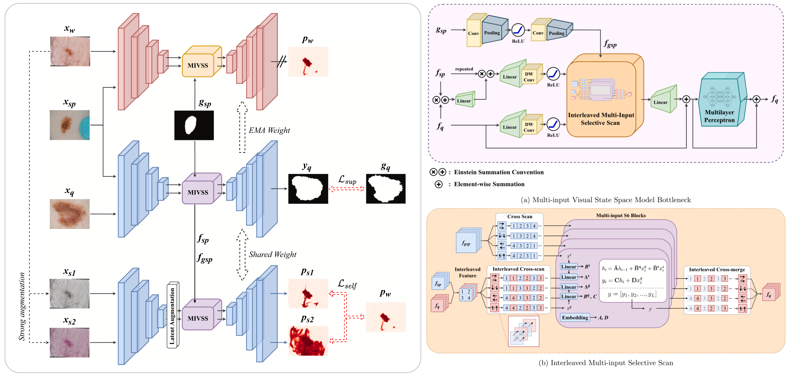

# 1S-MambaMatch
This is the official repository for the research "1S-MambaMatch: A Semi-supervised and One-shot Learning Framework with Multi-input Visual State Space Model for Skin Lesion Segmentation".

> **[1S-MambaMatch: A semi-supervised and One-shot learning framework with Multi-input Visual State Space Model for skin lesion segmentation](https://www.sciencedirect.com/science/article/abs/pii/S1746809426004295)**</br>
> Viet-Thanh Nguyen, Gia-Bao Truong, Van-Truong Pham and Thi-Thao Tran</br>
> *Biomedical Signal Processing and Control, Volume 119, Part B, 15 June 2026, 109875*

## Key Contributions

<p align="center">
  
</p>

<p align="center">
  <em>Figure: Overview of the proposed 1S-MambaMatch framework.</em>
</p>

- Unified **one-shot + semi-supervised framework**
- Plug-and-Play **Multi-input Visual State Space Model (MIVSS)** few-shot module
- Adaptive self-supervised loss for better unlabeled learning
---

## Project layout

- `configs/`: experiment configs (YAML)
- `datasets/`: ISIC `.npz` dataset + augmentations + few-shot batch sampler
- `models/`: U-Net + MambaMatch few-shot block
- `engine/`: train / eval loops, EMA utils, checkpointing
- `scripts/`: entrypoints (`train.py`)
- `notebooks/`: original notebook kept for reference

## Setup

Create an environment and install dependencies:

```bash
python -m venv .venv
source .venv/bin/activate
pip install -r requirements.txt
```

## Data

Place your dataset at `data/ISIC2018_train.npz` (or edit the config).

Expected `.npz` keys:
- **`image`**: `(N, H, W, 3)` (uint8)
- **`mask`**: `(N, H, W)` (uint8) where foreground is `1` (and optional ignore labels as in the notebook)

## Train

Semi-supervised
```bash
python -m scripts.train --config configs/isic18_semi_1shot.yaml
```
Supervised
```bash
python -m scripts.supervised --config configs/isic18_semi_1shot.yaml
```

Outputs (checkpoints + a `last.pth`) go to `outputs/` by default.

---
## Citation

If you find this work useful, please consider citing:

```bibtex
@article{nguyen2026mambamatch,
  title   = {1S-MambaMatch: A Semi-supervised and One-shot Learning Framework with Multi-input Visual State Space Model for Skin Lesion Segmentation},
  author  = {Nguyen, Viet-Thanh and Truong, Gia-Bao and Pham, Van-Truong and Tran, Thi-Thao},
  journal = {Biomedical Signal Processing and Control},
  volume  = {119},
  pages   = {109875},
  year    = {2026},
  publisher = {Elsevier}
}
>>>>>>> 31d29bf (Code publish for 1S-MambaMatch)
